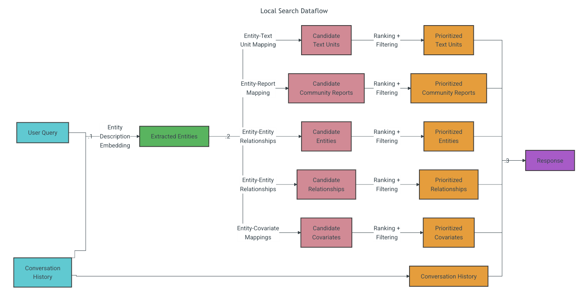

GraphRAGについて学習する。
とりあえず MS GraphRAGというのがOSSであるらしいので、それを試してみるということをやってみたい。
どうやら可視化などの機能もだいぶ充実しているらしいので、かなりプロジェクトに役に立つと考えている。

`graphrag init`
としたところ大量のpromptが手に入った。ちょっと何をしているか覗いてみる。
MS GraphRAGと言いつつ、別にAPI KeyはOpenAIのものでいいっぽいので、かなり親切。

最初に`settings.yaml`でモデルの指定ができる。gpt-5.2でやろうかなーと思ったが、
この大量のプロンプトを見る感じ、一回の検索にそれなりのサブエージェントを回す必要がありそうなので、コストは要確認。一旦gpt-4o-miniでやってみる。

https://speakerdeck.com/hide212131/the-trending-graphrag-understanding-its-potential-and-challenges?slide=31

目的としては、せっかくLangSmithとかのエコシステムを理解したので、それを試しつつ、GraphRAGを動かしてみたい。
`langchain-graphrag`というライブラリがあるらしいので、それを使ってみる。

`graphrag index`ってしたら、インデックスが貼られ始めた...!
かなり時間がかかっているが、ノードの追加などはどうするのかというのが問題その１かな

```bash
❯ graphrag query "What are the top themes in this story?"

The story is rich with themes that explore transformation, redemption, compassion, family, social critique, and the spirit of Christmas. Here is a detailed exploration of these themes:

### Personal Transformation Through Supernatural Intervention

One of the most prominent themes in the story is personal transformation, especially through supernatural means. Ebenezer Scrooge undergoes a profound change from being miserly and cold-hearted to becoming a benevolent and warm individual. This transformation is catalyzed by his encounters with the spirits who guide him through visions of his past, present, and possible futures, ultimately leading him to make significant personal changes [Data: Reports (6, 0, 13, 2, +more)].

### Redemption and Moral Atonement

Redemption is a key theme, encapsulating the moral lesson of atonement and self-improvement. The narrative illustrates Scrooge's journey from isolation to becoming a person who values love and community. His transformation serves as a powerful message that it is never too late to change and make amends, both personally and as a community member [Data: Reports (0, 13, 14)].

### Compassion Over Materialism

The story underscores the theme of compassion triumphing over materialism. Scrooge’s journey highlights the importance of empathy and nurturing personal connections instead of merely pursuing wealth. This theme is brought to light as Scrooge recognizes the negative consequences of his actions on others, prompting him to shift his values towards humanity and compassion [Data: Reports (2, 13)].

### Importance of Family and Familial Relationships

Family plays a crucial role in Scrooge's transformation. The story emphasizes positive family bonds through Scrooge’s interactions with his nephew Fred and his reflections of nurturing memories. These familial relationships present a backdrop for his change, stressing the significance of family as a foundation for positive transformation [Data: Reports (8, 0)].

### Social Critique of Poverty and Welfare

The narrative also serves as a social critique, particularly concerning poverty and welfare. Initially, Scrooge advocates for severe measures like Union Workhouses, revealing his lack of empathy towards the less fortunate. The story progresses to highlight the necessity for compassionate welfare approaches, as symbolized by characters such as The Gentlemen, who represent a more humane view of charity and support [Data: Reports (9)].

### The Spirit of Christmas

Lastly, the spirit of Christmas is an essential theme, depicted as a catalyst for change and a symbol of generosity and community. Scrooge’s internal journey is set amidst the Christmas season, underscoring its influence in fostering reflection, warmth, and togetherness. The narrative illustrates how the festive spirit inspires a reevaluation of values and a move towards embracing generosity [Data: Reports (5, 6)].

### Empathy and Redemption Through Others

The story reinforces the themes of empathy and redemption via the other characters, such as the Cratchit family. Despite their hardships, they display hope and resilience, providing a stark contrast to Scrooge's previous outlook. Their demeanor and circumstances serve as a powerful motivator for Scrooge, influencing his change in perspective and fostering his empathy [Data: Reports (10, 11, 1)].

Together, these themes convey a narrative rich in moral lessons and personal development, inviting readers to reflect on the importance of compassion, community, and personal growth.
```
と出てきた。クエリの流れをちゃんと追う必要あり。

```bash
--root                         -r                            DIRECTORY                   The project root directory.                      │
│                                                                                          [default: /Users/yoshi/graph_rag_study]          │
│ --method                       -m                            [local|global|drift|basic]  The query algorithm to use. [default: global]    │
│ --verbose                      -v                                                        Run the query with verbose logging.              │
│ --data                         -d                            PATH                        Index output directory (contains the parquet     │
│                                                                                          files).                                          │
│ --community-level                                            INTEGER                     Leiden hierarchy level from which to load        │
│                                                                                          community reports. Higher values represent       │
│                                                                                          smaller communities.                             │
│                                                                                          [default: 2]                                     │
│ --dynamic-community-selection      --no-dynamic-selection                                Use global search with dynamic community         │
│                                                                                          selection.                                       │
│                                                                                          [default: no-dynamic-selection]                  │
│ --response-type                                              TEXT                        Free-form description of the desired response    │
│                                                                                          format (e.g. 'Single Sentence', 'List of 3-7     │
│                                                                                          Points', etc.).                                  │
│                                                                                          [default: Multiple Paragraphs]                   │
│ --streaming                        --no-streaming                                        Print the response in a streaming manner.        │
│                                                                                          [default: no-streaming]                          │
│ --help                                                                                   Show this message and exit.
```
オプション一覧

https://microsoft.github.io/graphrag/query/overview/

ここにクエリ検索に関する詳細がある。

# Local Search

この図によると、対応するエンティティ（ノード？）によって、対応する文書なりレポートなりを取得してきてランキング＋フィルタリングして関連データを拾ってくるので、単純にノードを走査しているわけではなさそう。
