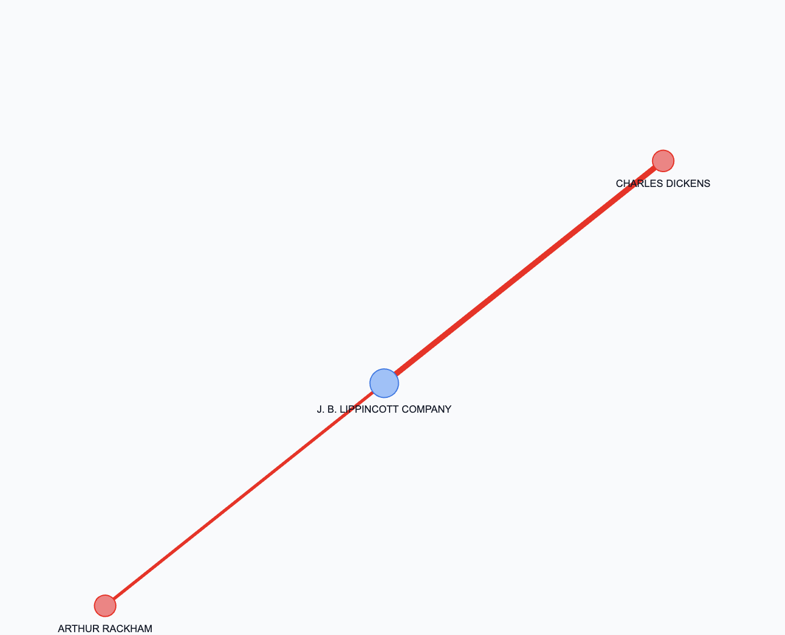
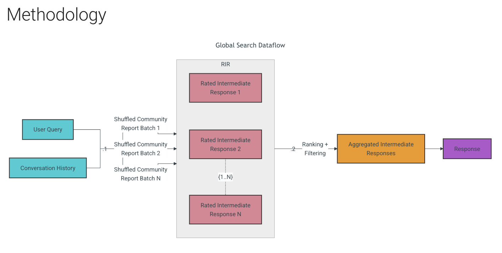

GraphRAGについて学習する。
とりあえず MS GraphRAGというのがOSSであるらしいので、それを試してみるということをやってみたい。
どうやら可視化などの機能もだいぶ充実しているらしいので、かなりプロジェクトに役に立つと考えている。

`graphrag init`
としたところ大量のpromptが手に入った。ちょっと何をしているか覗いてみる。
MS GraphRAGと言いつつ、別にAPI KeyはOpenAIのものでいいっぽいので、かなり親切。

最初に`settings.yaml`でモデルの指定ができる。gpt-5.2でやろうかなーと思ったが、
この大量のプロンプトを見る感じ、一回の検索にそれなりのサブエージェントを回す必要がありそうなので、コストは要確認。一旦gpt-4o-miniでやってみる。

https://speakerdeck.com/hide212131/the-trending-graphrag-understanding-its-potential-and-challenges?slide=31

目的としては、せっかくLangSmithとかのエコシステムを理解したので、それを試しつつ、GraphRAGを動かしてみたい。
`langchain-graphrag`というライブラリがあるらしいので、それを使ってみる。

`graphrag index`ってしたら、インデックスが貼られ始めた...!
かなり時間がかかっているが、ノードの追加などはどうするのかというのが問題その１かな

```bash
❯ graphrag query "What are the top themes in this story?"

The story is rich with themes that explore transformation, redemption, compassion, family, social critique, and the spirit of Christmas. Here is a detailed exploration of these themes:

### Personal Transformation Through Supernatural Intervention

One of the most prominent themes in the story is personal transformation, especially through supernatural means. Ebenezer Scrooge undergoes a profound change from being miserly and cold-hearted to becoming a benevolent and warm individual. This transformation is catalyzed by his encounters with the spirits who guide him through visions of his past, present, and possible futures, ultimately leading him to make significant personal changes [Data: Reports (6, 0, 13, 2, +more)].

### Redemption and Moral Atonement

Redemption is a key theme, encapsulating the moral lesson of atonement and self-improvement. The narrative illustrates Scrooge's journey from isolation to becoming a person who values love and community. His transformation serves as a powerful message that it is never too late to change and make amends, both personally and as a community member [Data: Reports (0, 13, 14)].

### Compassion Over Materialism

The story underscores the theme of compassion triumphing over materialism. Scrooge’s journey highlights the importance of empathy and nurturing personal connections instead of merely pursuing wealth. This theme is brought to light as Scrooge recognizes the negative consequences of his actions on others, prompting him to shift his values towards humanity and compassion [Data: Reports (2, 13)].

### Importance of Family and Familial Relationships

Family plays a crucial role in Scrooge's transformation. The story emphasizes positive family bonds through Scrooge’s interactions with his nephew Fred and his reflections of nurturing memories. These familial relationships present a backdrop for his change, stressing the significance of family as a foundation for positive transformation [Data: Reports (8, 0)].

### Social Critique of Poverty and Welfare

The narrative also serves as a social critique, particularly concerning poverty and welfare. Initially, Scrooge advocates for severe measures like Union Workhouses, revealing his lack of empathy towards the less fortunate. The story progresses to highlight the necessity for compassionate welfare approaches, as symbolized by characters such as The Gentlemen, who represent a more humane view of charity and support [Data: Reports (9)].

### The Spirit of Christmas

Lastly, the spirit of Christmas is an essential theme, depicted as a catalyst for change and a symbol of generosity and community. Scrooge’s internal journey is set amidst the Christmas season, underscoring its influence in fostering reflection, warmth, and togetherness. The narrative illustrates how the festive spirit inspires a reevaluation of values and a move towards embracing generosity [Data: Reports (5, 6)].

### Empathy and Redemption Through Others

The story reinforces the themes of empathy and redemption via the other characters, such as the Cratchit family. Despite their hardships, they display hope and resilience, providing a stark contrast to Scrooge's previous outlook. Their demeanor and circumstances serve as a powerful motivator for Scrooge, influencing his change in perspective and fostering his empathy [Data: Reports (10, 11, 1)].

Together, these themes convey a narrative rich in moral lessons and personal development, inviting readers to reflect on the importance of compassion, community, and personal growth.
```
と出てきた。クエリの流れをちゃんと追う必要あり。

```bash
--root                         -r                            DIRECTORY                   The project root directory.                      │
│                                                                                          [default: /Users/yoshi/graph_rag_study]          │
│ --method                       -m                            [local|global|drift|basic]  The query algorithm to use. [default: global]    │
│ --verbose                      -v                                                        Run the query with verbose logging.              │
│ --data                         -d                            PATH                        Index output directory (contains the parquet     │
│                                                                                          files).                                          │
│ --community-level                                            INTEGER                     Leiden hierarchy level from which to load        │
│                                                                                          community reports. Higher values represent       │
│                                                                                          smaller communities.                             │
│                                                                                          [default: 2]                                     │
│ --dynamic-community-selection      --no-dynamic-selection                                Use global search with dynamic community         │
│                                                                                          selection.                                       │
│                                                                                          [default: no-dynamic-selection]                  │
│ --response-type                                              TEXT                        Free-form description of the desired response    │
│                                                                                          format (e.g. 'Single Sentence', 'List of 3-7     │
│                                                                                          Points', etc.).                                  │
│                                                                                          [default: Multiple Paragraphs]                   │
│ --streaming                        --no-streaming                                        Print the response in a streaming manner.        │
│                                                                                          [default: no-streaming]                          │
│ --help                                                                                   Show this message and exit.
```
オプション一覧

https://microsoft.github.io/graphrag/query/overview/

ここにクエリ検索に関する詳細がある。


この図によると、対応するエンティティ（ノード？）によって、対応する文書なりレポートなりを取得してきてランキング＋フィルタリングして関連データを拾ってくるので、単純にノードを走査しているわけではなさそう。

# Local Search
まずはこれからやってみる。

```python
entity_df = pd.read_parquet(config.parquet_path(config.entity_table))
community_df = pd.read_parquet(config.parquet_path(config.community_table))
relationship_df = pd.read_parquet(config.parquet_path(config.relationship_table))
report_df = pd.read_parquet(config.parquet_path(config.community_report_table))
text_unit_df = pd.read_parquet(config.parquet_path(config.text_unit_table))
```
大量のデータフレームを読み込んでいる。

割と真面目に読みにくいので、`nano-graphrag`の方に乗り換えたい...

ので、nano-graphragに移行した。

GitHubのREADMEをコピペしてみたが、

```bash
INFO:httpx:HTTP Request: POST https://api.openai.com/v1/chat/completions "HTTP/1.1 429 Too Many Requests"
INFO:openai._base_client:Retrying request to /chat/completions in 7.862000 seconds
INFO:httpx:HTTP Request: POST https://api.openai.com/v1/chat/completions "HTTP/1.1 429 Too Many Requests"
INFO:httpx:HTTP Request: POST https://api.openai.com/v1/chat/completions "HTTP/1.1 429 Too Many Requests"
INFO:openai._base_client:Retrying request to /chat/completions in 8.062000 seconds
INFO:httpx:HTTP Request: POST https://api.openai.com/v1/chat/completions "HTTP/1.1 429 Too Many Requests"
INFO:openai._base_client:Retrying request to /chat/completions in 7.940000 seconds
INFO:httpx:HTTP Request: POST https://api.openai.com/v1/chat/completions "HTTP/1.1 429 Too Many Requests"
INFO:openai._base_client:Retrying request to /chat/completions in 8.138000 seconds
INFO:httpx:HTTP Request: POST https://api.openai.com/v1/chat/completions "HTTP/1.1 429 Too Many Requests"
INFO:openai._base_client:Retrying request to /chat/completions in 8.230000 seconds
INFO:httpx:HTTP Request: POST https://api.openai.com/v1/chat/completions "HTTP/1.1 429 Too Many Requests"
INFO:openai._base_client:Retrying request to /chat/completions in 7.821000 seconds
INFO:httpx:HTTP Request: POST https://api.openai.com/v1/chat/completions "HTTP/1.1 429 Too Many Requests"
INFO:openai._base_client:Retrying request to /chat/completions in 7.438000 seconds
INFO:httpx:HTTP Request: POST https://api.openai.com/v1/chat/completions "HTTP/1.1 429 Too Many Requests"
```
なんかDOSみたいになっちゃった

```bash
INFO:nano-graphrag:Revtrieved 1 communities
INFO:nano-graphrag:Grouping to 1 groups for global search
INFO:httpx:HTTP Request: POST https://api.openai.com/v1/chat/completions "HTTP/1.1 200 OK"
INFO:httpx:HTTP Request: POST https://api.openai.com/v1/chat/completions "HTTP/1.1 200 OK"
## Key Themes

### Enduring Legacy and Influence
One of the central themes is the enduring legacy and influence of the business entity of Scrooge and Marley. Despite Marley's death, the business continues to play a crucial role within the community, illustrating the lasting impact of their partnership. This theme emphasizes the idea that businesses, much like personal legacies, can transcend individual lifetimes and continue to affect communities and cultures long after key figures have passed.

### Solitary Nature and Personal Attachment
Another significant theme is Scrooge's solitary and miserly characteristics, which shape the dynamics of the community around him. His continued operation of the business under the original name 'Scrooge and Marley' signifies a deep attachment to the past, perhaps reflecting an inability or unwillingness to move forward or adapt. This theme highlights how personal traits and decisions can have broader implications not just for individuals, but for entire communities.

### Influence of Absent Figures
The continued influence of Marley, despite his physical absence, underscores how personal and professional relationships continue to shape the identity and operations of a business. This highlights the concept that individuals may leave lasting impressions through their actions and partnerships, affecting future narratives and operations of entities they were once part of.

### Historical and Cultural Backdrop
The story is also grounded in a cultural and societal context, illustrated through references to significant locations such as St. Paul's Churchyard. These references provide a historical backdrop that underscores the sense of continuity in Scrooge's life and situates the story within a broader historical and cultural narrative. This theme suggests that individual lives and business endeavors are often woven into the broader tapestry of society and history.

These themes collectively paint a detailed picture of how personal histories, business legacies, and cultural contexts intertwine to shape narratives, leaving lasting influences on communities and individuals alike.

--- local ---
INFO:httpx:HTTP Request: POST https://api.openai.com/v1/embeddings "HTTP/1.1 200 OK"
INFO:nano-graphrag:Using 12 entites, 1 communities, 6 relations, 2 text units
INFO:httpx:HTTP Request: POST https://api.openai.com/v1/chat/completions "HTTP/1.1 200 OK"
"A Christmas Carol" by Charles Dickens is a rich narrative with several prominent themes. Here are some of the top themes illustrated through the story's characters, events, and settings:

### **The Nature of Greed and Redemption**

The character of Ebenezer Scrooge epitomizes the theme of greed. He is depicted as a miserly and solitary figure whose fixation on accumulating wealth leads to a cold and joyless existence. The story highlights how unchecked greed can lead to a life devoid of personal connections and happiness. However, Scrooge's journey also underscores the theme of redemption. Through the intervention of various spirits, Scrooge reflects on his life, recognizes the errors of his ways, and transforms into a kinder, more generous person. This theme suggests that it is never too late for change and that redemption can lead to personal salvation and joy.

### **The Impact of Social Class and Poverty**

Dickens portrays the stark realities of social class and poverty in Victorian England, as seen in the lives of characters like Bob Cratchit and his family. Despite their financial struggles and Tiny Tim's ill health, the Cratchits demonstrate warmth, love, and happiness, contrasting with Scrooge's wealth and isolation. This highlights the theme that true happiness and richness in life come from relationships and family rather than material wealth. The story serves as a critique of the societal systems that marginalize the poor and emphasizes the moral responsibilities of the wealthy to help those less fortunate.

### **Time and Memory**

Time is a crucial element in "A Christmas Carol," with the narrative structure revolving around the visits of the Ghosts of Christmas Past, Present, and Yet to Come. These spirits force Scrooge to confront his memories, the current impacts of his behavior, and the potential future consequences if he remains unchanged. Through these visitations, Dickens explores how past experiences shape a person's identity and how the future can be altered by changes in the present. This emphasis on memory and foresight reflects the novel's message on the significance of personal growth and transformation.

### **The Importance of Compassion and Community**

The story underscores the importance of compassion, kindness, and the role of community. Scrooge's transformation is catalyzed by his recognition of the isolation caused by his lack of empathy and his failure to engage with those around him. By the end of the story, he becomes an active and caring member of his community, underlining the theme that individual happiness is intertwined with the well-being of others. Dickens advocates for a society where people are considerate and supportive, reflecting the spirit of Christmas as a time for giving and connection.

These themes together form a moral framework that has resonated with readers over the years and contributed to the enduring legacy of "A Christmas Carol." Each theme enriches the narrative and provides a powerful commentary on human nature and society.
```
とりあえず成功。
dickens/graph_chunk_entity_relation.graphml
に明らかにグラフっぽい何かがxml形式で書かれている。

htmlにしてみるとこんな感じ。(パラメタが雑なので写真を掲載)

内部コードの時間（nano-graphragはなんかdocsがイマイチなのでコードを読んだ方が良さそう）

```python
@dataclass
class GraphRAG:
    working_dir: str = field(
        default_factory=lambda: f"./nano_graphrag_cache_{datetime.now().strftime('%Y-%m-%d-%H:%M:%S')}"
    )
    # graph mode
    enable_local: bool = True
    enable_naive_rag: bool = False

    # text chunking
    chunk_func: Callable[
        [
            list[list[int]],
            List[str],
            tiktoken.Encoding,
            Optional[int],
            Optional[int],
        ],
        List[Dict[str, Union[str, int]]],
    ] = chunking_by_token_size
    chunk_token_size: int = 1200
    chunk_overlap_token_size: int = 100
    tiktoken_model_name: str = "gpt-4o"

    # entity extraction
    entity_extract_max_gleaning: int = 1
    entity_summary_to_max_tokens: int = 500

    # graph clustering
    graph_cluster_algorithm: str = "leiden"
    max_graph_cluster_size: int = 10
    graph_cluster_seed: int = 0xDEADBEEF

    # node embedding
    node_embedding_algorithm: str = "node2vec"
    node2vec_params: dict = field(
        default_factory=lambda: {
            "dimensions": 1536,
            "num_walks": 10,
            "walk_length": 40,
            "num_walks": 10,
            "window_size": 2,
            "iterations": 3,
            "random_seed": 3,
        }
    )

    # community reports
    special_community_report_llm_kwargs: dict = field(
        default_factory=lambda: {"response_format": {"type": "json_object"}}
    )

    # text embedding
    embedding_func: EmbeddingFunc = field(default_factory=lambda: openai_embedding)
    embedding_batch_num: int = 32
    embedding_func_max_async: int = 16
    query_better_than_threshold: float = 0.2

    # LLM
    using_azure_openai: bool = False
    best_model_func: callable = gpt_4o_complete
    best_model_max_token_size: int = 32768
    best_model_max_async: int = 16
    cheap_model_func: callable = gpt_4o_mini_complete
    cheap_model_max_token_size: int = 32768
    cheap_model_max_async: int = 16

    # entity extraction
    entity_extraction_func: callable = extract_entities

    # storage
    key_string_value_json_storage_cls: Type[BaseKVStorage] = JsonKVStorage
    vector_db_storage_cls: Type[BaseVectorStorage] = NanoVectorDBStorage
    vector_db_storage_cls_kwargs: dict = field(default_factory=dict)
    graph_storage_cls: Type[BaseGraphStorage] = NetworkXStorage
    enable_llm_cache: bool = True

    # extension
    always_create_working_dir: bool = True
    addon_params: dict = field(default_factory=dict)
    convert_response_to_json_func: callable = convert_response_to_json
```

```python
enable_local: bool = True
```
MS GraphRAGにもlocalとか色々あったが、これはなんなんだろうか


local search と global searchの解説はこっちの方が良さそう。

global searchは文書全体を跨ぐ質問の時使い、local searchは特定の対象に限定するときに使うんだとか。

```python
if param.mode == "local":
            response = await local_query(
                query,
                self.chunk_entity_relation_graph,
                self.entities_vdb,
                self.community_reports,
                self.text_chunks,
                param,
                asdict(self),
            )
elif param.mode == "global":
    response = await global_query(
        query,
        self.chunk_entity_relation_graph,
        self.entities_vdb,
        self.community_reports,
        self.text_chunks,
        param,
        asdict(self),
    )
```
このようにハンドリングされている。
とりあえずlocal searchから見る。
```python
async def local_query(
    query,
    knowledge_graph_inst: BaseGraphStorage,
    entities_vdb: BaseVectorStorage,
    community_reports: BaseKVStorage[CommunitySchema],
    text_chunks_db: BaseKVStorage[TextChunkSchema],
    query_param: QueryParam,
    global_config: dict,
) -> str:
    use_model_func = global_config["best_model_func"]
    context = await _build_local_query_context(
        query,
        knowledge_graph_inst,
        entities_vdb,
        community_reports,
        text_chunks_db,
        query_param,
    )
    if query_param.only_need_context:
        return context
    if context is None:
        return PROMPTS["fail_response"]
    sys_prompt_temp = PROMPTS["local_rag_response"]
    sys_prompt = sys_prompt_temp.format(
        context_data=context, response_type=query_param.response_type
    )
    response = await use_model_func(
        query,
        system_prompt=sys_prompt,
    )
    return response
```
この時点では特に違いがあるようには見えないので、`_build_local_query_context`次第
みた感じ、いろんなVector DBについてRanking（通常のRAG）を行った上で、関連コンテキストを取得している...？

それ以前にストアの種類がたくさんあるので、一つ一つ何ものか調べる。