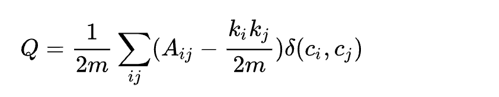

前回の続き。
とりあえずGraphRAGの全体フローが全くわかっていないので、どういうものかをきっちり整理していきたい。
## GraphRAGがやっていること
文書全体を読み込んで、登場する人・組織・概念をノードに、その関係をエッジにした地図（ナレッジグラフ）を先に作っておく。そのグラフを使って「AはBと関係があり、BはCとも関係がある、だからAとCには間接的な繋がりがある」という横断的推論を可能にする仕組み。
### Index
まず、MS GraphRAGであれば`graphrag index`のようにしてインデックスを貼るという事をする。
これについて説明していく。まあ基本的には「グラフを作る」」というフェーズになる。文書(PDF,TXT...)を整理して以下のようなものを作っていく。
- エンティティ・リレーションシップナレッジグラフ（エンティティ同士の関係性を記述）
- コミュニティ（エンティティの所属・分類+要約文（コミュニティレポート））
- テキストユニット（エンティティに紐づけられている）
このような関係性のある百科事典のようなものを作成している。
一般的なGraphRAGと異なり、文書同士の関係性などのデータを付与することができていると言える。
これを使うと、エンティティ同士の関係性をもとに、ベクトライズだけでは得にくい関係性を持たせることが可能だし、コミュニティレポートをもとに文書の全体的な意味合いなども取得できるので、精度が上がりそうな気配は確かにある。
`nano-graphrag`ではここ。
```python
if should_index:
        text = input_path.read_text(encoding="utf-8")
        text_to_insert = text if args.full_input else text[: args.max_chars]
        print(f"indexing started: chars={len(text_to_insert)} (full={args.full_input})")
        try:
            graph_func.insert(text_to_insert)
            marker.write_text("ok\n", encoding="utf-8")
            print("indexing completed")
        except Exception as exc:
            body = getattr(exc, "body", None)
            print("indexing failed")
            print(f"error_type={type(exc).__name__}")
            print(f"error_body={body}")
```
これの`graph_func.insert`でやっている。

実際のインデックスの流れを以下に記述する。
#### Text Unit
テキストをチャンキングする部分。
```python
def chunking_by_token_size(
    tokens_list: list[list[int]],
    doc_keys,
    tiktoken_model,
    overlap_token_size=128,
    max_token_size=1024,
):

    results = []
    for index, tokens in enumerate(tokens_list):
        chunk_token = []
        lengths = []
        for start in range(0, len(tokens), max_token_size - overlap_token_size):

            chunk_token.append(tokens[start : start + max_token_size])
            lengths.append(min(max_token_size, len(tokens) - start))

        # here somehow tricky, since the whole chunk tokens is list[list[list[int]]] for corpus(doc(chunk)),so it can't be decode entirely
        chunk_token = tiktoken_model.decode_batch(chunk_token)
        for i, chunk in enumerate(chunk_token):

            results.append(
                {
                    "tokens": lengths[i],
                    "content": chunk.strip(),
                    "chunk_order_index": i,
                    "full_doc_id": doc_keys[index],
                }
            )

    return results


def chunking_by_seperators(
    tokens_list: list[list[int]],
    doc_keys,
    tiktoken_model,
    overlap_token_size=128,
    max_token_size=1024,
):

    splitter = SeparatorSplitter(
        separators=[
            tiktoken_model.encode(s) for s in PROMPTS["default_text_separator"]
        ],
        chunk_size=max_token_size,
        chunk_overlap=overlap_token_size,
    )
    results = []
    for index, tokens in enumerate(tokens_list):
        chunk_token = splitter.split_tokens(tokens)
        lengths = [len(c) for c in chunk_token]

        # here somehow tricky, since the whole chunk tokens is list[list[list[int]]] for corpus(doc(chunk)),so it can't be decode entirely
        chunk_token = tiktoken_model.decode_batch(chunk_token)
        for i, chunk in enumerate(chunk_token):

            results.append(
                {
                    "tokens": lengths[i],
                    "content": chunk.strip(),
                    "chunk_order_index": i,
                    "full_doc_id": doc_keys[index],
                }
            )

    return results


def get_chunks(new_docs, chunk_func=chunking_by_token_size, **chunk_func_params):
    inserting_chunks = {}

    new_docs_list = list(new_docs.items())
    docs = [new_doc[1]["content"] for new_doc in new_docs_list]
    doc_keys = [new_doc[0] for new_doc in new_docs_list]

    ENCODER = tiktoken.encoding_for_model("gpt-4o")
    tokens = ENCODER.encode_batch(docs, num_threads=16)
    chunks = chunk_func(
        tokens, doc_keys=doc_keys, tiktoken_model=ENCODER, **chunk_func_params
    )

    for chunk in chunks:
        inserting_chunks.update(
            {compute_mdhash_id(chunk["content"], prefix="chunk-"): chunk}
        )

    return inserting_chunks
```
`nano-graphrag`ではこの辺が該当する部分。
まあ割と雑というか、`langchain`の`RecursiveCharacterTextSplitter`くらいのノリ。
```python
PROMPTS["default_text_separator"] = [
    # Paragraph separators
    "\n\n",
    "\r\n\r\n",
    # Line breaks
    "\n",
    "\r\n",
    # Sentence ending punctuation
    "。",  # Chinese period
    "．",  # Full-width dot
    ".",  # English period
    "！",  # Chinese exclamation mark
    "!",  # English exclamation mark
    "？",  # Chinese question mark
    "?",  # English question mark
    # Whitespace characters
    " ",  # Space
    "\t",  # Tab
    "\u3000",  # Full-width space
    # Special characters
    "\u200b",  # Zero-width space (used in some Asian languages)
]
```
ここら辺の文字があったら切りますよという事をしていて、再帰でもない。
ちなみに、
```python
def split_tokens(self, tokens: List[int]) -> List[List[int]]:
        splits = self._split_tokens_with_separators(tokens)
        return self._merge_splits(splits)

    def _split_tokens_with_separators(self, tokens: List[int]) -> List[List[int]]:
        splits = []
        current_split = []
        i = 0
        while i < len(tokens):
            separator_found = False
            for separator in self._separators:
                if tokens[i:i+len(separator)] == separator:
                    if self._keep_separator in [True, "end"]:
                        current_split.extend(separator)
                    if current_split:
                        splits.append(current_split)
                        current_split = []
                    if self._keep_separator == "start":
                        current_split.extend(separator)
                    i += len(separator)
                    separator_found = True
                    break
            if not separator_found:
                current_split.append(tokens[i])
                i += 1
        if current_split:
            splits.append(current_split)
        return [s for s in splits if s]
```
`split_token`関数はこのようになっている。かなり雑な処理ではある
`_keep_separator`は「区切りトークンをどう扱うか」を定めるもので、`True`か`"end"`であればチャンクの末尾に、`"start"`であれば次のトークンの先頭にという処理なのだが、
```python
if self._keep_separator in [True, "end"]:
    current_split.extend(separator)
    current_split = []
elif self._keep_separator == "start":
    current_split = []
    current_split.extend(separator)
```
と等価な処理である。（まとめて書いてあるのでちょっとわかりにくいが、時系列的な処理）
要するに`titoken`でうまいことトークナイズして、あとはそれに従ってトークンサイズorセパレータ基準で前から切っているという感じ。
#### エンティティ抽出
得られたテキストユニットから全てのエンティティ（人物、場所、組織など）、それらの関係性、および重要な要素を抜き取ってくる。
```python
maybe_new_kg = await self.entity_extraction_func(
                inserting_chunks,
                knwoledge_graph_inst=self.chunk_entity_relation_graph,
                entity_vdb=self.entities_vdb,
                global_config=asdict(self),
            )
```
`nano-graphrag`だとこの部分でやっている。`graph.insert()`で呼び出される。
```python
async def extract_entities(
    chunks: dict[str, TextChunkSchema],
    knwoledge_graph_inst: BaseGraphStorage,
    entity_vdb: BaseVectorStorage,
    global_config: dict,
) -> Union[BaseGraphStorage, None]:
    use_llm_func: callable = global_config["best_model_func"]
    entity_extract_max_gleaning = global_config["entity_extract_max_gleaning"]

    ordered_chunks = list(chunks.items())

    entity_extract_prompt = PROMPTS["entity_extraction"]
    context_base = dict(
        tuple_delimiter=PROMPTS["DEFAULT_TUPLE_DELIMITER"],
        record_delimiter=PROMPTS["DEFAULT_RECORD_DELIMITER"],
        completion_delimiter=PROMPTS["DEFAULT_COMPLETION_DELIMITER"],
        entity_types=",".join(PROMPTS["DEFAULT_ENTITY_TYPES"]),
    )
    continue_prompt = PROMPTS["entiti_continue_extraction"]
    if_loop_prompt = PROMPTS["entiti_if_loop_extraction"]

    already_processed = 0
    already_entities = 0
    already_relations = 0

    async def _process_single_content(chunk_key_dp: tuple[str, TextChunkSchema]):
        nonlocal already_processed, already_entities, already_relations
        chunk_key = chunk_key_dp[0]
        chunk_dp = chunk_key_dp[1]
        content = chunk_dp["content"]
        hint_prompt = entity_extract_prompt.format(**context_base, input_text=content)
        final_result = await use_llm_func(hint_prompt)

        history = pack_user_ass_to_openai_messages(hint_prompt, final_result)
        for now_glean_index in range(entity_extract_max_gleaning):
            glean_result = await use_llm_func(continue_prompt, history_messages=history)

            history += pack_user_ass_to_openai_messages(continue_prompt, glean_result)
            final_result += glean_result
            if now_glean_index == entity_extract_max_gleaning - 1:
                break

            if_loop_result: str = await use_llm_func(
                if_loop_prompt, history_messages=history
            )
            if_loop_result = if_loop_result.strip().strip('"').strip("'").lower()
            if if_loop_result != "yes":
                break

        records = split_string_by_multi_markers(
            final_result,
            [context_base["record_delimiter"], context_base["completion_delimiter"]],
        )

        maybe_nodes = defaultdict(list)
        maybe_edges = defaultdict(list)
        for record in records:
            record = re.search(r"\((.*)\)", record)
            if record is None:
                continue
            record = record.group(1)
            record_attributes = split_string_by_multi_markers(
                record, [context_base["tuple_delimiter"]]
            )
            if_entities = await _handle_single_entity_extraction(
                record_attributes, chunk_key
            )
            if if_entities is not None:
                maybe_nodes[if_entities["entity_name"]].append(if_entities)
                continue

            if_relation = await _handle_single_relationship_extraction(
                record_attributes, chunk_key
            )
            if if_relation is not None:
                maybe_edges[(if_relation["src_id"], if_relation["tgt_id"])].append(
                    if_relation
                )
        already_processed += 1
        already_entities += len(maybe_nodes)
        already_relations += len(maybe_edges)
        now_ticks = PROMPTS["process_tickers"][
            already_processed % len(PROMPTS["process_tickers"])
        ]
        print(
            f"{now_ticks} Processed {already_processed} chunks, {already_entities} entities(duplicated), {already_relations} relations(duplicated)\r",
            end="",
            flush=True,
        )
        return dict(maybe_nodes), dict(maybe_edges)

    # use_llm_func is wrapped in ascynio.Semaphore, limiting max_async callings
    results = await asyncio.gather(
        *[_process_single_content(c) for c in ordered_chunks]
    )
    print()  # clear the progress bar
    maybe_nodes = defaultdict(list)
    maybe_edges = defaultdict(list)
    for m_nodes, m_edges in results:
        for k, v in m_nodes.items():
            maybe_nodes[k].extend(v)
        for k, v in m_edges.items():
            # it's undirected graph
            maybe_edges[tuple(sorted(k))].extend(v)
    all_entities_data = await asyncio.gather(
        *[
            _merge_nodes_then_upsert(k, v, knwoledge_graph_inst, global_config)
            for k, v in maybe_nodes.items()
        ]
    )
    await asyncio.gather(
        *[
            _merge_edges_then_upsert(k[0], k[1], v, knwoledge_graph_inst, global_config)
            for k, v in maybe_edges.items()
        ]
    )
    if not len(all_entities_data):
        logger.warning("Didn't extract any entities, maybe your LLM is not working")
        return None
    if entity_vdb is not None:
        data_for_vdb = {
            compute_mdhash_id(dp["entity_name"], prefix="ent-"): {
                "content": dp["entity_name"] + dp["description"],
                "entity_name": dp["entity_name"],
            }
            for dp in all_entities_data
        }
        await entity_vdb.upsert(data_for_vdb)
    return knwoledge_graph_inst
```
実装本体はこちら。
長いので以下に区分けして説明していく。
```python
async def _process_single_content(chunk_key_dp: tuple[str, TextChunkSchema]):
        nonlocal already_processed, already_entities, already_relations
        chunk_key = chunk_key_dp[0]
        chunk_dp = chunk_key_dp[1]
        content = chunk_dp["content"]
        hint_prompt = entity_extract_prompt.format(**context_base, input_text=content)
        final_result = await use_llm_func(hint_prompt)

        history = pack_user_ass_to_openai_messages(hint_prompt, final_result)
        for now_glean_index in range(entity_extract_max_gleaning):
            glean_result = await use_llm_func(continue_prompt, history_messages=history)

            history += pack_user_ass_to_openai_messages(continue_prompt, glean_result)
            final_result += glean_result
            if now_glean_index == entity_extract_max_gleaning - 1:
                break

            if_loop_result: str = await use_llm_func(
                if_loop_prompt, history_messages=history
            )
            if_loop_result = if_loop_result.strip().strip('"').strip("'").lower()
            if if_loop_result != "yes":
                break

        records = split_string_by_multi_markers(
            final_result,
            [context_base["record_delimiter"], context_base["completion_delimiter"]],
        )

        maybe_nodes = defaultdict(list)
        maybe_edges = defaultdict(list)
        for record in records:
            record = re.search(r"\((.*)\)", record)
            if record is None:
                continue
            record = record.group(1)
            record_attributes = split_string_by_multi_markers(
                record, [context_base["tuple_delimiter"]]
            )
            if_entities = await _handle_single_entity_extraction(
                record_attributes, chunk_key
            )
            if if_entities is not None:
                maybe_nodes[if_entities["entity_name"]].append(if_entities)
                continue

            if_relation = await _handle_single_relationship_extraction(
                record_attributes, chunk_key
            )
            if if_relation is not None:
                maybe_edges[(if_relation["src_id"], if_relation["tgt_id"])].append(
                    if_relation
                )
        already_processed += 1
        already_entities += len(maybe_nodes)
        already_relations += len(maybe_edges)
        now_ticks = PROMPTS["process_tickers"][
            already_processed % len(PROMPTS["process_tickers"])
        ]
        print(
            f"{now_ticks} Processed {already_processed} chunks, {already_entities} entities(duplicated), {already_relations} relations(duplicated)\r",
            end="",
            flush=True,
        )
        return dict(maybe_nodes), dict(maybe_edges)
```
1チャンクのテキストから、LLMを使ってエンティティと関係を抽出する。
```python
def get_chunks(new_docs, chunk_func=chunking_by_token_size, **chunk_func_params):
    #~~~~

    for chunk in chunks:
        inserting_chunks.update(
            {compute_mdhash_id(chunk["content"], prefix="chunk-"): chunk}
        )

    return inserting_chunks
```
実は、チャンクの取得時には`compute_mdhash_id`という関数によってチャンクごとにidが割り振られている。
`chunk_key`はそれ。`chunk_dp`はおそらくdatapointのこと。
このchunk_dp["context"]に対して、hint_promptをもとにエンティティを抜き出してこいとLLMにお願いしている。
(`use_llm_func`はopenaiの薄いラッパー)
```python
PROMPTS[
    "entity_extraction"
] = """-Goal-
Given a text document that is potentially relevant to this activity and a list of entity types, identify all entities of those types from the text and all relationships among the identified entities.

-Steps-
1. Identify all entities. For each identified entity, extract the following information:
- entity_name: Name of the entity, capitalized
- entity_type: One of the following types: [{entity_types}]
- entity_description: Comprehensive description of the entity's attributes and activities
Format each entity as ("entity"{tuple_delimiter}<entity_name>{tuple_delimiter}<entity_type>{tuple_delimiter}<entity_description>

2. From the entities identified in step 1, identify all pairs of (source_entity, target_entity) that are *clearly related* to each other.
For each pair of related entities, extract the following information:
- source_entity: name of the source entity, as identified in step 1
- target_entity: name of the target entity, as identified in step 1
- relationship_description: explanation as to why you think the source entity and the target entity are related to each other
- relationship_strength: a numeric score indicating strength of the relationship between the source entity and target entity
 Format each relationship as ("relationship"{tuple_delimiter}<source_entity>{tuple_delimiter}<target_entity>{tuple_delimiter}<relationship_description>{tuple_delimiter}<relationship_strength>)

3. Return output in English as a single list of all the entities and relationships identified in steps 1 and 2. Use **{record_delimiter}** as the list delimiter.

4. When finished, output {completion_delimiter}

######################
-Examples-
######################
Example 1:

Entity_types: [person, technology, mission, organization, location]
Text:
while Alex clenched his jaw, the buzz of frustration dull against the backdrop of Taylor's authoritarian certainty. It was this competitive undercurrent that kept him alert, the sense that his and Jordan's shared commitment to discovery was an unspoken rebellion against Cruz's narrowing vision of control and order.

Then Taylor did something unexpected. They paused beside Jordan and, for a moment, observed the device with something akin to reverence. “If this tech can be understood..." Taylor said, their voice quieter, "It could change the game for us. For all of us.”

The underlying dismissal earlier seemed to falter, replaced by a glimpse of reluctant respect for the gravity of what lay in their hands. Jordan looked up, and for a fleeting heartbeat, their eyes locked with Taylor's, a wordless clash of wills softening into an uneasy truce.

It was a small transformation, barely perceptible, but one that Alex noted with an inward nod. They had all been brought here by different paths
################
Output:
("entity"{tuple_delimiter}"Alex"{tuple_delimiter}"person"{tuple_delimiter}"Alex is a character who experiences frustration and is observant of the dynamics among other characters."){record_delimiter}
("entity"{tuple_delimiter}"Taylor"{tuple_delimiter}"person"{tuple_delimiter}"Taylor is portrayed with authoritarian certainty and shows a moment of reverence towards a device, indicating a change in perspective."){record_delimiter}
("entity"{tuple_delimiter}"Jordan"{tuple_delimiter}"person"{tuple_delimiter}"Jordan shares a commitment to discovery and has a significant interaction with Taylor regarding a device."){record_delimiter}
("entity"{tuple_delimiter}"Cruz"{tuple_delimiter}"person"{tuple_delimiter}"Cruz is associated with a vision of control and order, influencing the dynamics among other characters."){record_delimiter}
("entity"{tuple_delimiter}"The Device"{tuple_delimiter}"technology"{tuple_delimiter}"The Device is central to the story, with potential game-changing implications, and is revered by Taylor."){record_delimiter}
("relationship"{tuple_delimiter}"Alex"{tuple_delimiter}"Taylor"{tuple_delimiter}"Alex is affected by Taylor's authoritarian certainty and observes changes in Taylor's attitude towards the device."{tuple_delimiter}7){record_delimiter}
("relationship"{tuple_delimiter}"Alex"{tuple_delimiter}"Jordan"{tuple_delimiter}"Alex and Jordan share a commitment to discovery, which contrasts with Cruz's vision."{tuple_delimiter}6){record_delimiter}
("relationship"{tuple_delimiter}"Taylor"{tuple_delimiter}"Jordan"{tuple_delimiter}"Taylor and Jordan interact directly regarding the device, leading to a moment of mutual respect and an uneasy truce."{tuple_delimiter}8){record_delimiter}
("relationship"{tuple_delimiter}"Jordan"{tuple_delimiter}"Cruz"{tuple_delimiter}"Jordan's commitment to discovery is in rebellion against Cruz's vision of control and order."{tuple_delimiter}5){record_delimiter}
("relationship"{tuple_delimiter}"Taylor"{tuple_delimiter}"The Device"{tuple_delimiter}"Taylor shows reverence towards the device, indicating its importance and potential impact."{tuple_delimiter}9){completion_delimiter}
#############################
Example 2:

Entity_types: [person, technology, mission, organization, location]
Text:
They were no longer mere operatives; they had become guardians of a threshold, keepers of a message from a realm beyond stars and stripes. This elevation in their mission could not be shackled by regulations and established protocols—it demanded a new perspective, a new resolve.

Tension threaded through the dialogue of beeps and static as communications with Washington buzzed in the background. The team stood, a portentous air enveloping them. It was clear that the decisions they made in the ensuing hours could redefine humanity's place in the cosmos or condemn them to ignorance and potential peril.

Their connection to the stars solidified, the group moved to address the crystallizing warning, shifting from passive recipients to active participants. Mercer's latter instincts gained precedence— the team's mandate had evolved, no longer solely to observe and report but to interact and prepare. A metamorphosis had begun, and Operation: Dulce hummed with the newfound frequency of their daring, a tone set not by the earthly
#############
Output:
("entity"{tuple_delimiter}"Washington"{tuple_delimiter}"location"{tuple_delimiter}"Washington is a location where communications are being received, indicating its importance in the decision-making process."){record_delimiter}
("entity"{tuple_delimiter}"Operation: Dulce"{tuple_delimiter}"mission"{tuple_delimiter}"Operation: Dulce is described as a mission that has evolved to interact and prepare, indicating a significant shift in objectives and activities."){record_delimiter}
("entity"{tuple_delimiter}"The team"{tuple_delimiter}"organization"{tuple_delimiter}"The team is portrayed as a group of individuals who have transitioned from passive observers to active participants in a mission, showing a dynamic change in their role."){record_delimiter}
("relationship"{tuple_delimiter}"The team"{tuple_delimiter}"Washington"{tuple_delimiter}"The team receives communications from Washington, which influences their decision-making process."{tuple_delimiter}7){record_delimiter}
("relationship"{tuple_delimiter}"The team"{tuple_delimiter}"Operation: Dulce"{tuple_delimiter}"The team is directly involved in Operation: Dulce, executing its evolved objectives and activities."{tuple_delimiter}9){completion_delimiter}
#############################
Example 3:

Entity_types: [person, role, technology, organization, event, location, concept]
Text:
their voice slicing through the buzz of activity. "Control may be an illusion when facing an intelligence that literally writes its own rules," they stated stoically, casting a watchful eye over the flurry of data.

"It's like it's learning to communicate," offered Sam Rivera from a nearby interface, their youthful energy boding a mix of awe and anxiety. "This gives talking to strangers' a whole new meaning."

Alex surveyed his team—each face a study in concentration, determination, and not a small measure of trepidation. "This might well be our first contact," he acknowledged, "And we need to be ready for whatever answers back."

Together, they stood on the edge of the unknown, forging humanity's response to a message from the heavens. The ensuing silence was palpable—a collective introspection about their role in this grand cosmic play, one that could rewrite human history.

The encrypted dialogue continued to unfold, its intricate patterns showing an almost uncanny anticipation
#############
Output:
("entity"{tuple_delimiter}"Sam Rivera"{tuple_delimiter}"person"{tuple_delimiter}"Sam Rivera is a member of a team working on communicating with an unknown intelligence, showing a mix of awe and anxiety."){record_delimiter}
("entity"{tuple_delimiter}"Alex"{tuple_delimiter}"person"{tuple_delimiter}"Alex is the leader of a team attempting first contact with an unknown intelligence, acknowledging the significance of their task."){record_delimiter}
("entity"{tuple_delimiter}"Control"{tuple_delimiter}"concept"{tuple_delimiter}"Control refers to the ability to manage or govern, which is challenged by an intelligence that writes its own rules."){record_delimiter}
("entity"{tuple_delimiter}"Intelligence"{tuple_delimiter}"concept"{tuple_delimiter}"Intelligence here refers to an unknown entity capable of writing its own rules and learning to communicate."){record_delimiter}
("entity"{tuple_delimiter}"First Contact"{tuple_delimiter}"event"{tuple_delimiter}"First Contact is the potential initial communication between humanity and an unknown intelligence."){record_delimiter}
("entity"{tuple_delimiter}"Humanity's Response"{tuple_delimiter}"event"{tuple_delimiter}"Humanity's Response is the collective action taken by Alex's team in response to a message from an unknown intelligence."){record_delimiter}
("relationship"{tuple_delimiter}"Sam Rivera"{tuple_delimiter}"Intelligence"{tuple_delimiter}"Sam Rivera is directly involved in the process of learning to communicate with the unknown intelligence."{tuple_delimiter}9){record_delimiter}
("relationship"{tuple_delimiter}"Alex"{tuple_delimiter}"First Contact"{tuple_delimiter}"Alex leads the team that might be making the First Contact with the unknown intelligence."{tuple_delimiter}10){record_delimiter}
("relationship"{tuple_delimiter}"Alex"{tuple_delimiter}"Humanity's Response"{tuple_delimiter}"Alex and his team are the key figures in Humanity's Response to the unknown intelligence."{tuple_delimiter}8){record_delimiter}
("relationship"{tuple_delimiter}"Control"{tuple_delimiter}"Intelligence"{tuple_delimiter}"The concept of Control is challenged by the Intelligence that writes its own rules."{tuple_delimiter}7){completion_delimiter}
#############################
-Real Data-
######################
Entity_types: {entity_types}
Text: {input_text}
######################
Output:
"""
```
これがプロンプト。どういうふうな思想で設計されたのかは不明だが、有名なossのものだしかなりしっかりしたものなのかな？みた感じ、関係性の強さなどもLLMを使って計算しているわけだが、`gpt-4o`だとあんまり当てにならないかも...
ところで、これは1つのプロンプトで適当に全部やっているわけだが、これでそんなに効果があるのかな
Few-shotによる例示がかなり丁寧に作られているので、それがいいのかもしれない。Few-shot重要！

```python
for now_glean_index in range(entity_extract_max_gleaning):
    glean_result = await use_llm_func(continue_prompt, history_messages=history)

    history += pack_user_ass_to_openai_messages(continue_prompt, glean_result)
    final_result += glean_result
    if now_glean_index == entity_extract_max_gleaning - 1:
        break

    if_loop_result: str = await use_llm_func(
        if_loop_prompt, history_messages=history
    )
    if_loop_result = if_loop_result.strip().strip('"').strip("'").lower()
    if if_loop_result != "yes":
        break
```
`entity_extract_max_gleaning`は`GraphRAG`クラスで1回と定義されている。
追加でさっきの抽出を行う。
```python
PROMPTS[
    "entiti_continue_extraction"
] = """MANY entities were missed in the last extraction.  Add them below using the same format:
"""
```
という感じでllmにやってもらう。
```python
PROMPTS[
    "entiti_if_loop_extraction"
] = """It appears some entities may have still been missed.  Answer YES | NO if there are still entities that need to be added.
"""
"""
```
もう十分かどうかもllmに判定してもらっている。これくらい雑なのか
```python
records = split_string_by_multi_markers(
            final_result,
            [context_base["record_delimiter"], context_base["completion_delimiter"]],
        )
maybe_nodes = defaultdict(list)
maybe_edges = defaultdict(list)
for record in records:
    record = re.search(r"\((.*)\)", record)
    if record is None:
        continue
    record = record.group(1)
    record_attributes = split_string_by_multi_markers(
        record, [context_base["tuple_delimiter"]]
    )
    if_entities = await _handle_single_entity_extraction(
        record_attributes, chunk_key
    )
    if if_entities is not None:
        maybe_nodes[if_entities["entity_name"]].append(if_entities)
        continue

    if_relation = await _handle_single_relationship_extraction(
        record_attributes, chunk_key
    )
    if if_relation is not None:
        maybe_edges[(if_relation["src_id"], if_relation["tgt_id"])].append(
            if_relation
        )
already_processed += 1
already_entities += len(maybe_nodes)
already_relations += len(maybe_edges)
now_ticks = PROMPTS["process_tickers"][
    already_processed % len(PROMPTS["process_tickers"])
]
print(
    f"{now_ticks} Processed {already_processed} chunks, {already_entities} entities(duplicated), {already_relations} relations(duplicated)\r",
    end="",
    flush=True,
)
return dict(maybe_nodes), dict(maybe_edges)
```
ここで、正規表現として抽出したデータをプログラムで処理しやすい形に変化させる。最初からjsonとかで撮ればいいのになと言いつつ、delimiter方式であればレスポンスが不安定なモデルでも動くのは確かにいいね。

あとは集約してvdbに登録して終わり。
なぜかvdbに登録するのにテキストのまま与えているので、内部で勝手にベクトライズされるのだろう。`langchain`でも確かそんな感じだった。
#### グラフクラスタリング
ここで、上のエンティティ抽出によって得られたノードの関係性には濃淡がある。
「同じコミュニティ内のエッジが密で、コミュニティ間のエッジが疎になる」ような分割を行う。
これによって、クラスタの定義をすることができるので、コミュニティノートを書くときの境界がはっきりする。
`graph_cluster_algorithm: str = "leiden"`
とある。どうやらLeiden法というアルゴリズムを使用しているようだ。
http://en.wikipedia.org/wiki/Leiden_algorithm
Wikiの資料はこちら。

要するにこのModularityという指標を高くできるように分割するためのヒューリスティックなアルゴリズムである。
適当に切ってみて、あるノードが隣のクラスタに移動した時にこのModularityが高くなるなら実行するというアルゴリズム。
modularityについてもうすこしちゃんと説明すると、A_ijはあるノードiとあるノードjについての関係性の強さ。kikj/2mはそのノードiとそのノードjの持つ関係性の濃淡の期待値を指し示す。つまり、実際のつながり - (期待されるつながり)
の計算式。クロネッカーデルタはi,jが同じクラスタに所属していれば1、そうでなければ0を表す。

なので、期待値よりもいい繋がりを持っているペアは同じクラスタとして扱いたいよねというのをくりかえしている。
あとはrefinementとかaggregationによって精度を上げている。
`graphslogic`というライブラリに具体実装があるが、重そうなので今度に回す。

#### コミュニティレポート作成
それぞれのクラスタについて要約を行う。

```python
async def _pack_single_community_describe(
    knwoledge_graph_inst: BaseGraphStorage,
    community: SingleCommunitySchema,
    max_token_size: int = 12000,
    already_reports: dict[str, CommunitySchema] = {},
    global_config: dict = {},
) -> str:
    nodes_in_order = sorted(community["nodes"])
    edges_in_order = sorted(community["edges"], key=lambda x: x[0] + x[1])

    nodes_data = await asyncio.gather(
        *[knwoledge_graph_inst.get_node(n) for n in nodes_in_order]
    )
    edges_data = await asyncio.gather(
        *[knwoledge_graph_inst.get_edge(src, tgt) for src, tgt in edges_in_order]
    )
    node_fields = ["id", "entity", "type", "description", "degree"]
    edge_fields = ["id", "source", "target", "description", "rank"]
    nodes_list_data = [
        [
            i,
            node_name,
            node_data.get("entity_type", "UNKNOWN"),
            node_data.get("description", "UNKNOWN"),
            await knwoledge_graph_inst.node_degree(node_name),
        ]
        for i, (node_name, node_data) in enumerate(zip(nodes_in_order, nodes_data))
    ]
    nodes_list_data = sorted(nodes_list_data, key=lambda x: x[-1], reverse=True)
    nodes_may_truncate_list_data = truncate_list_by_token_size(
        nodes_list_data, key=lambda x: x[3], max_token_size=max_token_size // 2
    )
    edges_list_data = [
        [
            i,
            edge_name[0],
            edge_name[1],
            edge_data.get("description", "UNKNOWN"),
            await knwoledge_graph_inst.edge_degree(*edge_name),
        ]
        for i, (edge_name, edge_data) in enumerate(zip(edges_in_order, edges_data))
    ]
    edges_list_data = sorted(edges_list_data, key=lambda x: x[-1], reverse=True)
    edges_may_truncate_list_data = truncate_list_by_token_size(
        edges_list_data, key=lambda x: x[3], max_token_size=max_token_size // 2
    )

    truncated = len(nodes_list_data) > len(nodes_may_truncate_list_data) or len(
        edges_list_data
    ) > len(edges_may_truncate_list_data)

    # If context is exceed the limit and have sub-communities:
    report_describe = ""
    need_to_use_sub_communities = (
        truncated and len(community["sub_communities"]) and len(already_reports)
    )
    force_to_use_sub_communities = global_config["addon_params"].get(
        "force_to_use_sub_communities", False
    )
    if need_to_use_sub_communities or force_to_use_sub_communities:
        logger.debug(
            f"Community {community['title']} exceeds the limit or you set force_to_use_sub_communities to True, using its sub-communities"
        )
        report_describe, report_size, contain_nodes, contain_edges = (
            _pack_single_community_by_sub_communities(
                community, max_token_size, already_reports
            )
        )
        report_exclude_nodes_list_data = [
            n for n in nodes_list_data if n[1] not in contain_nodes
        ]
        report_include_nodes_list_data = [
            n for n in nodes_list_data if n[1] in contain_nodes
        ]
        report_exclude_edges_list_data = [
            e for e in edges_list_data if (e[1], e[2]) not in contain_edges
        ]
        report_include_edges_list_data = [
            e for e in edges_list_data if (e[1], e[2]) in contain_edges
        ]
        # if report size is bigger than max_token_size, nodes and edges are []
        nodes_may_truncate_list_data = truncate_list_by_token_size(
            report_exclude_nodes_list_data + report_include_nodes_list_data,
            key=lambda x: x[3],
            max_token_size=(max_token_size - report_size) // 2,
        )
        edges_may_truncate_list_data = truncate_list_by_token_size(
            report_exclude_edges_list_data + report_include_edges_list_data,
            key=lambda x: x[3],
            max_token_size=(max_token_size - report_size) // 2,
        )
    nodes_describe = list_of_list_to_csv([node_fields] + nodes_may_truncate_list_data)
    edges_describe = list_of_list_to_csv([edge_fields] + edges_may_truncate_list_data)
    return f"""-----Reports-----
```csv
{report_describe}
```
-----Entities-----
```csv
{nodes_describe}
```
-----Relationships-----
```csv
{edges_describe}
```"""
```
`nano-graphrag`の実装では、まずこのようにそれぞれのクラスタについて
```python
node_fields = ["id", "entity", "type", "description", "degree"]
edge_fields = ["id", "source", "target", "description", "rank"]
```
のように、辺情報+nodeの情報をある程度平坦にして渡す。
まあトポロジーの詳細は見えにくくなるが、情報圧縮しないといけないから仕方ないよなという感じ。文章で渡すのは厳しい！
https://dl.acm.org/doi/10.1145/3786600
↑どうやらLLM4Graphみたいな研究はやられているみたい。
ともかくあとはLLMに「コミュニティレポート作って！」のように投げればOK
```python
PROMPTS[
    "community_report"
] = """You are an AI assistant that helps a human analyst to perform general information discovery. 
Information discovery is the process of identifying and assessing relevant information associated with certain entities (e.g., organizations and individuals) within a network.

# Goal
Write a comprehensive report of a community, given a list of entities that belong to the community as well as their relationships and optional associated claims. The report will be used to inform decision-makers about information associated with the community and their potential impact. The content of this report includes an overview of the community's key entities, their legal compliance, technical capabilities, reputation, and noteworthy claims.

# Report Structure

The report should include the following sections:

- TITLE: community's name that represents its key entities - title should be short but specific. When possible, include representative named entities in the title.
- SUMMARY: An executive summary of the community's overall structure, how its entities are related to each other, and significant information associated with its entities.
- IMPACT SEVERITY RATING: a float score between 0-10 that represents the severity of IMPACT posed by entities within the community.  IMPACT is the scored importance of a community.
- RATING EXPLANATION: Give a single sentence explanation of the IMPACT severity rating.
- DETAILED FINDINGS: A list of 5-10 key insights about the community. Each insight should have a short summary followed by multiple paragraphs of explanatory text grounded according to the grounding rules below. Be comprehensive.

Return output as a well-formed JSON-formatted string with the following format:
    {{
        "title": <report_title>,
        "summary": <executive_summary>,
        "rating": <impact_severity_rating>,
        "rating_explanation": <rating_explanation>,
        "findings": [
            {{
                "summary":<insight_1_summary>,
                "explanation": <insight_1_explanation>
            }},
            {{
                "summary":<insight_2_summary>,
                "explanation": <insight_2_explanation>
            }}
            ...
        ]
    }}

# Grounding Rules
Do not include information where the supporting evidence for it is not provided.


# Example Input
-----------
Text:
```
Entities:
```csv
id,entity,type,description
5,VERDANT OASIS PLAZA,geo,Verdant Oasis Plaza is the location of the Unity March
6,HARMONY ASSEMBLY,organization,Harmony Assembly is an organization that is holding a march at Verdant Oasis Plaza
```
Relationships:
```csv
id,source,target,description
37,VERDANT OASIS PLAZA,UNITY MARCH,Verdant Oasis Plaza is the location of the Unity March
38,VERDANT OASIS PLAZA,HARMONY ASSEMBLY,Harmony Assembly is holding a march at Verdant Oasis Plaza
39,VERDANT OASIS PLAZA,UNITY MARCH,The Unity March is taking place at Verdant Oasis Plaza
40,VERDANT OASIS PLAZA,TRIBUNE SPOTLIGHT,Tribune Spotlight is reporting on the Unity march taking place at Verdant Oasis Plaza
41,VERDANT OASIS PLAZA,BAILEY ASADI,Bailey Asadi is speaking at Verdant Oasis Plaza about the march
43,HARMONY ASSEMBLY,UNITY MARCH,Harmony Assembly is organizing the Unity March
```
```
Output:
{{
    "title": "Verdant Oasis Plaza and Unity March",
    "summary": "The community revolves around the Verdant Oasis Plaza, which is the location of the Unity March. The plaza has relationships with the Harmony Assembly, Unity March, and Tribune Spotlight, all of which are associated with the march event.",
    "rating": 5.0,
    "rating_explanation": "The impact severity rating is moderate due to the potential for unrest or conflict during the Unity March.",
    "findings": [
        {{
            "summary": "Verdant Oasis Plaza as the central location",
            "explanation": "Verdant Oasis Plaza is the central entity in this community, serving as the location for the Unity March. This plaza is the common link between all other entities, suggesting its significance in the community. The plaza's association with the march could potentially lead to issues such as public disorder or conflict, depending on the nature of the march and the reactions it provokes."
        }},
        {{
            "summary": "Harmony Assembly's role in the community",
            "explanation": "Harmony Assembly is another key entity in this community, being the organizer of the march at Verdant Oasis Plaza. The nature of Harmony Assembly and its march could be a potential source of threat, depending on their objectives and the reactions they provoke. The relationship between Harmony Assembly and the plaza is crucial in understanding the dynamics of this community."
        }},
        {{
            "summary": "Unity March as a significant event",
            "explanation": "The Unity March is a significant event taking place at Verdant Oasis Plaza. This event is a key factor in the community's dynamics and could be a potential source of threat, depending on the nature of the march and the reactions it provokes. The relationship between the march and the plaza is crucial in understanding the dynamics of this community."
        }},
        {{
            "summary": "Role of Tribune Spotlight",
            "explanation": "Tribune Spotlight is reporting on the Unity March taking place in Verdant Oasis Plaza. This suggests that the event has attracted media attention, which could amplify its impact on the community. The role of Tribune Spotlight could be significant in shaping public perception of the event and the entities involved."
        }}
    ]
}}


# Real Data

Use the following text for your answer. Do not make anything up in your answer.

Text:
```
{input_text}
```

The report should include the following sections:

- TITLE: community's name that represents its key entities - title should be short but specific. When possible, include representative named entities in the title.
- SUMMARY: An executive summary of the community's overall structure, how its entities are related to each other, and significant information associated with its entities.
- IMPACT SEVERITY RATING: a float score between 0-10 that represents the severity of IMPACT posed by entities within the community.  IMPACT is the scored importance of a community.
- RATING EXPLANATION: Give a single sentence explanation of the IMPACT severity rating.
- DETAILED FINDINGS: A list of 5-10 key insights about the community. Each insight should have a short summary followed by multiple paragraphs of explanatory text grounded according to the grounding rules below. Be comprehensive.

Return output as a well-formed JSON-formatted string with the following format:
    {{
        "title": <report_title>,
        "summary": <executive_summary>,
        "rating": <impact_severity_rating>,
        "rating_explanation": <rating_explanation>,
        "findings": [
            {{
                "summary":<insight_1_summary>,
                "explanation": <insight_1_explanation>
            }},
            {{
                "summary":<insight_2_summary>,
                "explanation": <insight_2_explanation>
            }}
            ...
        ]
    }}

# Grounding Rules
Do not include information where the supporting evidence for it is not provided.

Output:
"""
```
これがプロンプト
`"rating": 5.0`のように、0-10段階でコミュニティレポートに重要度スコアをつけている。ローカル検索の時に、あるコミュニティのうちいくつのエンティティがヒットしたかによって引っ張ってくるコミュニティレポートを定めるが、同率だった時はこのratingを使用するらしい。タイブレーク要員